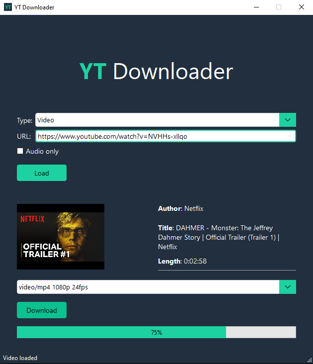
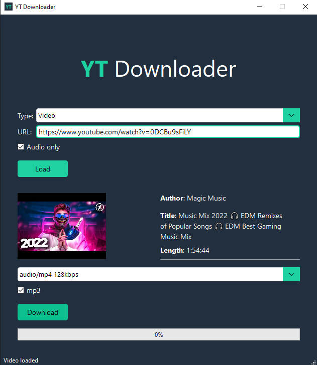

<p align="center">
    
    <p align="center">Python application that allows you to download videos and music from youtube</p>
</p>

<hr>

## Preview




## Technology
* pyqt6
* pytube

## Installation
Create a virtual environment
```
python -m venv .venv
```
Activate virtual environment

Windows
```
$ .venv\Scripts\activate
```
Linux
```
source ./.venv/bin/activate
```
Install dependency
```
$ pip install -r requirements.txt
```